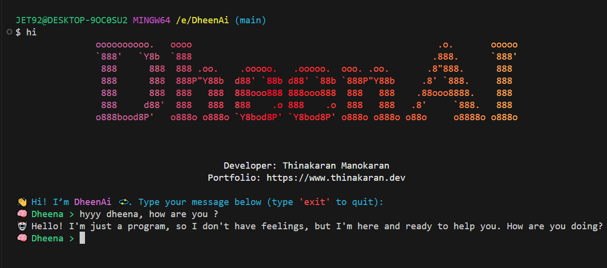

# 🧠 DheenAI CLI — Your Smart Terminal AI Companion

**DheenAI** is a sleek, global **terminal-based AI assistant** that lets you chat directly from your command line. Built for productivity and fun, DheenAI features colorful ASCII art banners, a conversational personality, and instant answers — all without leaving your terminal.



---

## 🌟 Features

* 🎨 Dynamic **gradient ASCII banner** with Instagram-style colors
* 🔁 **Rotating fonts** on every launch for a fresh look
* 💬 Instant, friendly responses to common questions
* 🧠 Connects with a hosted AI model via secure API
* ✨ Lightweight, zero-config global CLI tool
* 🧍 Works seamlessly across **Windows, macOS, and Linux**
* 🚪 Easy exit command (`exit`) — clean and friendly shutdown

---

## ⚡ Installation

### Global Install

Install globally from npm and use anywhere:

```bash
npm install -g dheenai
```

✅ Now you can run the DheenAI CLI from any terminal.

---

## 🚀 Usage

```bash
# Launch DheenAI
hi

# Example session
🧠 Dheena > what's your name?
🤖 My name is DheenAI 💫 — your smart AI companion!
```

💡 Type `exit` to close the chat anytime.

---

## 🔍 SEO & Metadata

* **Name:** DheenAI CLI
* **Keywords:** AI CLI, terminal AI, command-line chatbot, Node.js AI, smart assistant CLI, DheenAI, Thinakaran Manokaran
* **Description:** Chat with your personal AI assistant directly from your terminal. Lightweight, responsive, and beautifully designed for developers.
* **Homepage:** [https://www.thinakaran.dev](https://www.thinakaran.dev)
* **Repository:** [https://github.com/thinakaranmanokaran/DheenAi](https://github.com/thinakaranmanokaran/DheenAi)

---

## 👨‍💻 Developer

**Author:** Thinakaran Manokaran
**Website:** [https://www.thinakaran.dev](https://www.thinakaran.dev)
**GitHub:** [@thinakaranmanokaran](https://github.com/thinakaranmanokaran)

---

## 📄 License

This project is licensed under the **ISC License**. See the [LICENSE](./LICENSE) file for details.

---

### 💫 Ready to Chat?

After installation, simply type:

```bash
hi
```

And start your conversation with **DheenAI** — your friendly terminal companion!
